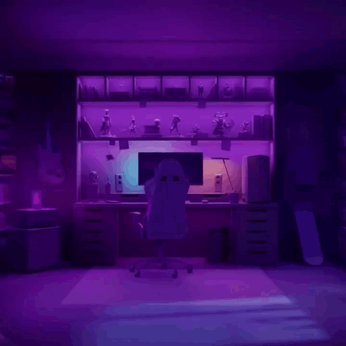

## 🔥 AcGaming15

**`Hello!! I I'm Austin or people call me AcGaming! 👋`**

## About Me


I Love Playing Video Games Like Rust and FiveM, I would like to become a software engineer or creating my own Video Games.

##

# 🎈 Languages am learning
- C++
- C#
- Python
- Lua

#

# Sample Code

# C++

```
#include <iostream>
#include <string>

using namespace std;

int main() {

	string input;

	cout << "Whats your Name \n";

	cin >> input;

	cout << "Hello " << input;

	return 0;

}
```

# Socials

 <p align="left">
      <a href="https://www.youtube.com/@AcGaming1514?sub_confirmation=1">
         </a> 
      <a href="https://www.youtube.com/c/fknight">
         </a> 
      <a href="https://github.com/austincabler13?tab=followers">
         </a>
      <a href="https://github.com/austincabler13?tab=repositories&sort=stargazers">
         </a>
   </p>

### 📊 Stats


